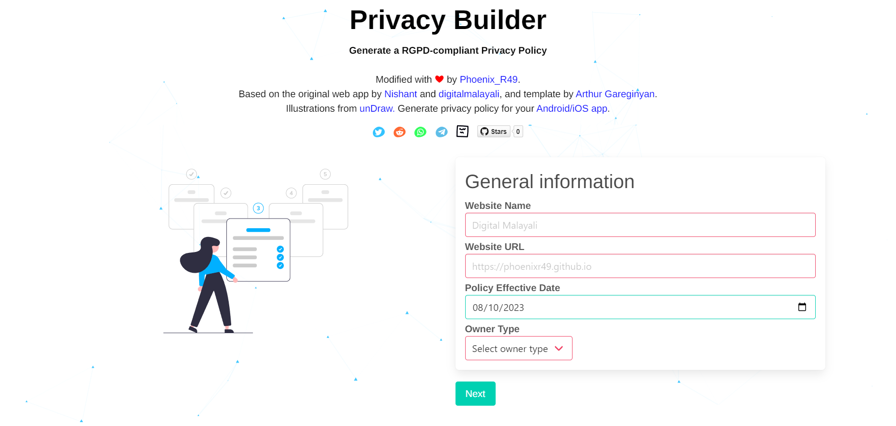
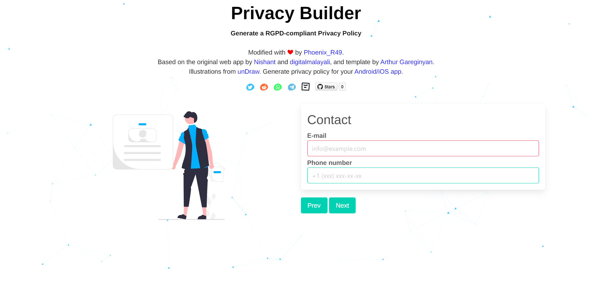
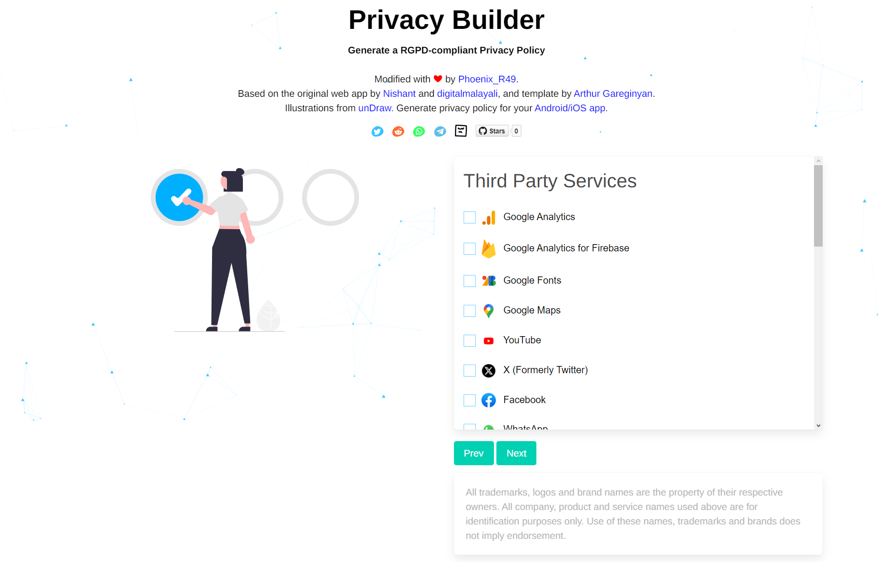

    
  

<strong>
  <em>An open-source and simple privacy policy generator for your website</em>
</strong>
  
 
For generating privacy policy for apps, <a href="https://app-privacy-policy-generator.nisrulz.com/">click here</a> instead.

 

## Web App

## Author & Contributors 🙏

This project is a modified version of the original web app by [Nishant Srivastava](https://github.com/nisrulz/nisrulz.github.io#nishant-srivastava) and template written by [Arthur Gareginyan](https://github.com/ArthurGareginyan/privacy-policy-template). Please consider supporting them.

Illustrations by Katerina Limpitsouni via [unDraw](https://undraw.co/). Background using [particles.js](https://github.com/VincentGarreau/particles.js/).

## Ways You Can Help/Support this project 💕

- **Star** this repository and tell all your friends about it.
- **Watch** for new releases to get an update if something happens.
- [**Open an Issue**](https://github.com/PhoenixR49/privacy-builder/issues/new/choose) if you catch any error in copy text or within the project itself.
- **Open a Pull Request** to include support for adding more 3rd party service's links or fixes against [existing issues](https://github.com/PhoenixR49/privacy-builder/issues).

- Tell us you like this project or how it helped you out!

  - [Comment in the project's discussions](https://github.com/PhoenixR49/privacy-builder/discussions) :blush:,
  - or [send us a nice email](mailto:contact@digitalmalayali.in)!

Thanks for your interest in this :heart:

## Screenshots 💻

 
 

## License 📝

© Copyright 2025 Phoenix_R49, Digital Malayali, Nishant Srivastava, Arthur Gareginyan
